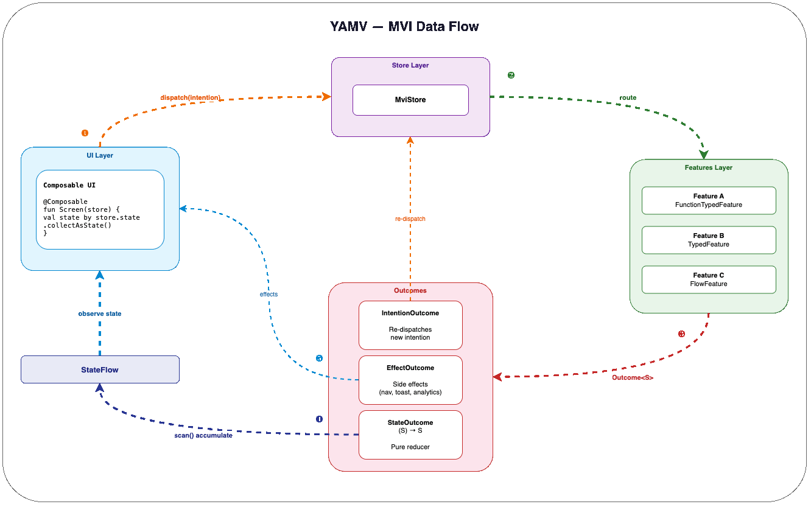

# YAMV — Yet Another MVI Framework

[](https://github.com/ktomek/yamv/actions/workflows/ci.yml)
[](https://jitpack.io/#ktomek/yamv)
[](LICENSE)

A Kotlin-first **MVI (Model-View-Intent)** framework for Android & Kotlin Multiplatform with compile-time code generation via KSP.

- **Reactive** — state management via Kotlin Coroutines & Flow
- **Type-safe** — sealed intentions, typed features, compile-time generation
- **Multiplatform** — Android (Hilt or Koin) + iOS (Compose Multiplatform + Koin)
- **Zero boilerplate** — `@AutoState` + `@AutoFeature` generate the retained store and Hilt/Koin modules

<p align="center">
  
</p>

## Why YAMV?

Most state management approaches — whether MVVM ViewModels or MVI frameworks with central reducers — tend toward the same problem: logic accumulates in one place. The ViewModel becomes a god object, or the reducer becomes a god function with dozens of cases.

YAMV takes a different approach: **there is no central reducer**.

### Distributed reducers

In a typical MVI framework, a single `reduce()` function handles every action:

```kotlin
// Typical MVI — one reducer grows with every action
fun reduce(state: S, action: Action): S = when (action) {
    is Increment -> state.copy(count = state.count + 1)
    is SetLoading -> state.copy(loading = true)
    is SetData -> state.copy(data = action.data)
    // ... grows linearly
}
```

In YAMV, each state transformation is its own `StateOutcome` class — a pure `(S) -> S` function:

```kotlin
class IncrementOutcome : StateOutcome<CounterState> {
    override fun reduce(prevState: CounterState) =
        prevState.copy(count = prevState.count + 1)
}
```

Testing is trivial — no coroutines, no Flow, no store setup:

```kotlin
@Test fun `increment adds one`() {
    val result = IncrementOutcome().reduce(CounterState(count = 5))
    assertThat(result.count).isEqualTo(6)
}
```

### Separation of "when" from "what"

A **Feature** decides *when* and *which* outcome to emit (the orchestration). An **Outcome** decides *how* state changes (the transformation). Two independent concerns, two independent test targets.

### Forced modularity

Each feature handles one intention type. Each outcome handles one state transition. Adding new behavior means adding a new file — not modifying an existing ViewModel or reducer. Features are injected as a `Set<Feature<S>>`, so they are truly pluggable: add or remove a feature from the DI set without touching any other code.

### Composable by design

`Set<Feature<S>>` injection means features can be conditionally included via DI configuration — A/B tests, feature flags, build variants — without touching any code. Swap, add, or remove behaviors entirely at the wiring level.

### Multithreading by convention

Features run on `Dispatchers.Default` (concurrent), reducers apply on `Dispatchers.Main` (serialized) — correct by default. No manual dispatcher management per method. Per-feature and per-state dispatcher customization is available when needed.

## Quick Start

### 1. Add JitPack repository

```kotlin
// settings.gradle.kts
dependencyResolutionManagement {
    repositories {
        maven { url = uri("https://jitpack.io") }
    }
}
```

### 2. Add dependencies

```kotlin
// build.gradle.kts (app module)
dependencies {
    // Core framework
    implementation("com.github.ktomek.yamv:yamv:VERSION")

    // Android ViewModel integration
    implementation("com.github.ktomek.yamv:yamv-retainer:VERSION")

    // Choose your DI integration:
    implementation("com.github.ktomek.yamv:yamv-hilt:VERSION")   // Hilt
    // or
    implementation("com.github.ktomek.yamv:yamv-koin:VERSION")   // Koin (multiplatform)

    // KSP code generation (Hilt only)
    ksp("com.github.ktomek.yamv:processor-hilt:VERSION")
}
```

Replace `VERSION` with the latest badge version above.

### 3. Define your state and intentions

```kotlin
@AutoState
data class CounterState(val count: Int = 0) : State

sealed class CounterIntention {
    data object Increment : CounterIntention()
    data object Decrement : CounterIntention()
}
```

### 4. Define reducers and features

Declare reducers as separate classes — decoupled from features, independently testable:

```kotlin
// Outcome — pure (S) -> S, tested without coroutines
class IncrementOutcome : StateOutcome<CounterState> {
    override fun reduce(prevState: CounterState) =
        prevState.copy(count = prevState.count + 1)
}

// Feature — maps intentions to outcomes
@AutoFeature
class IncrementFeature : TypedFeature<CounterState, CounterIntention.Increment> {
    override fun invoke(intentions: Flow<CounterIntention.Increment>): Flow<Outcome<CounterState>> =
        intentions.map { IncrementOutcome() }
}
```

### 5. Collect state in your Composable

```kotlin
@Composable
fun CounterScreen(store: CounterStateStore = hiltMviStore()) {
    val state by store.state.collectAsStateWithLifecycle()

    Column {
        Text("Count: ${state.count}")
        Button(onClick = { store.dispatch(CounterIntention.Increment) }) {
            Text("+")
        }
    }
}
```

That's it. `@AutoState` generates `CounterStateStore` and `@AutoFeature` generates the Hilt bindings.

## Modules

| Module | Description | Platform |
|--------|-------------|----------|
| `core` | Marker interfaces & annotations (`State`, `Outcome`, `@AutoState`, `@AutoFeature`) | Pure Kotlin |
| `yamv` | Core runtime (`MviRuntime`, `MviStore`, `FeatureRouter`) | Kotlin Multiplatform |
| `yamv-retainer` | `MviRetainedStore` — lifecycle-retained ViewModel base | Android + iOS |
| `yamv-hilt` | `hiltMviStore()` Compose helper | Android |
| `yamv-koin` | `koinMviStore()` / `mviStore {}` DSL | Kotlin Multiplatform |
| `processor-core` | KSP utilities (DI-agnostic) | JVM |
| `processor-hilt` | Hilt KSP processor — generates `*Store` + `*FeaturesModule` | JVM |

## Documentation

Full documentation: **[ktomek.github.io/yamv](https://ktomek.github.io/yamv)**

- [Getting Started](https://ktomek.github.io/yamv/getting-started/)
- [Architecture](https://ktomek.github.io/yamv/architecture/)
- [Features Guide](https://ktomek.github.io/yamv/features/)
- [Code Generation](https://ktomek.github.io/yamv/code-generation/)
- [Multiplatform Setup](https://ktomek.github.io/yamv/multiplatform/)

## License

```
Copyright 2024 Tomasz Kaszkowiak

Licensed under the Apache License, Version 2.0 (the "License");
you may not use this file except in compliance with the License.
You may obtain a copy of the License at

    http://www.apache.org/licenses/LICENSE-2.0
```
